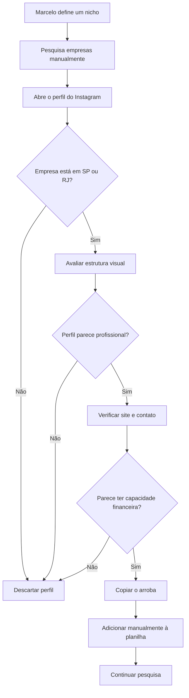

# Fluxo atual — AS-IS

```mermaid
flowchart TD
    A[Marcelo define um nicho] --> B[Pesquisa empresas manualmente]
    B --> C[Abre o perfil do Instagram]
    C --> D{Empresa está em SP ou RJ?}

    D -- Não --> E[Descartar perfil]
    D -- Sim --> F[Avaliar estrutura visual]

    F --> G{Perfil parece profissional?}
    G -- Não --> E
    G -- Sim --> H[Verificar site e contato]

    H --> I{Parece ter capacidade financeira?}
    I -- Não --> E
    I -- Sim --> J[Copiar o arroba]

    J --> K[Adicionar manualmente à planilha]
    K --> L[Continuar pesquisa]
```