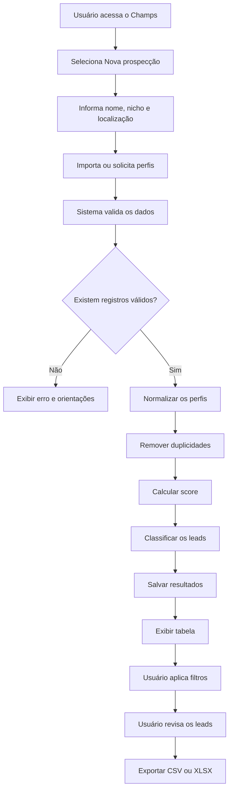

# Fluxo da prospecção — TO-BE

```mermaid
flowchart TD
    A[Usuário acessa o Champs] --> B[Seleciona Nova prospecção]
    B --> C[Informa nome, nicho e localização]
    C --> D[Importa ou solicita perfis]
    D --> E[Sistema valida os dados]

    E --> F{Existem registros válidos?}
    F -- Não --> G[Exibir erro e orientações]
    F -- Sim --> H[Normalizar os perfis]

    H --> I[Remover duplicidades]
    I --> J[Calcular score]
    J --> K[Classificar os leads]
    K --> L[Salvar resultados]

    L --> M[Exibir tabela]
    M --> N[Usuário aplica filtros]
    N --> O[Usuário revisa os leads]
    O --> P[Exportar CSV ou XLSX]
```