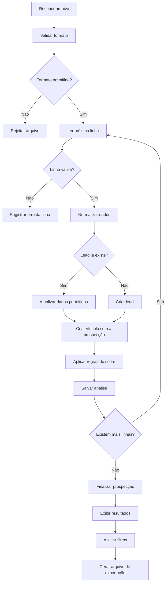

# Fluxo de importação, score e exportação

```mermaid
flowchart TD
    A[Receber arquivo] --> B[Validar formato]
    B --> C{Formato permitido?}

    C -- Não --> D[Rejeitar arquivo]
    C -- Sim --> E[Ler próxima linha]

    E --> F{Linha válida?}
    F -- Não --> G[Registrar erro da linha]
    F -- Sim --> H[Normalizar dados]

    H --> I{Lead já existe?}
    I -- Sim --> J[Atualizar dados permitidos]
    I -- Não --> K[Criar lead]

    J --> L[Criar vínculo com a prospecção]
    K --> L

    L --> M[Aplicar regras de score]
    M --> N[Salvar análise]
    N --> O{Existem mais linhas?}

    O -- Sim --> E
    O -- Não --> P[Finalizar prospecção]

    P --> Q[Exibir resultados]
    Q --> R[Aplicar filtros]
    R --> S[Gerar arquivo de exportação]
```