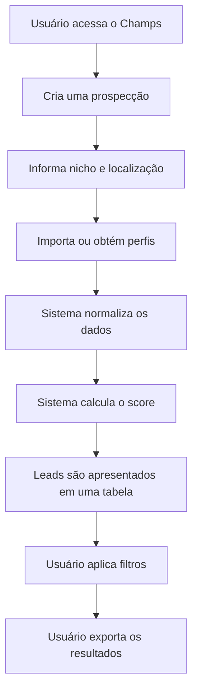

# Visão geral do Champs

## Contexto

O Champs é um sistema de prospecção e qualificação de potenciais clientes
para gestores de tráfego.

O primeiro usuário será Marcelo, gestor de tráfego que precisa identificar
empresas com capacidade financeira e estrutura comercial para contratar
uma operação de marketing digital.

## Objetivo

Reduzir o trabalho manual necessário para:

- localizar possíveis clientes;
- verificar se o perfil representa uma empresa real;
- identificar a localização;
- avaliar a estrutura digital da empresa;
- classificar o potencial comercial;
- organizar os resultados;
- exportar os contatos para uma planilha.

## Público-alvo inicial

Empresas localizadas prioritariamente nos estados:

- São Paulo;
- Rio de Janeiro.

Esses estados serão priorizados por apresentarem maior concentração de
empresas e maior potencial de contratação de serviços de gestão de tráfego.

## Plataforma-base

O Champs será desenvolvido dentro da plataforma existente do ChatBotCRM.

Serão reutilizados:

- autenticação;
- usuários;
- empresas ou tenants;
- permissões;
- banco de dados;
- infraestrutura Docker;
- componentes visuais;
- serviços compartilhados;
- tratamento de erros;
- estrutura de frontend e backend.

## Tecnologias existentes

### Backend

- PHP;
- Laravel;
- banco de dados relacional;
- execução por Docker.

### Frontend

- React;
- TypeScript;
- Vite;
- componentes reutilizáveis do CRM.

## Fluxo principal

## Resultado esperado

Ao final do MVP, o Marcelo deverá conseguir acessar uma interface própria,
analisar potenciais clientes e gerar uma planilha contendo os perfis mais
promissores.