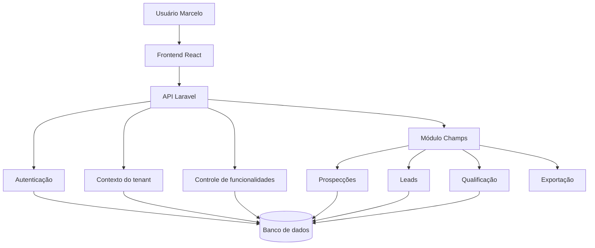

# Arquitetura do Champs

## Decisão arquitetural

O Champs não será criado como um sistema totalmente independente.

Ele será um módulo white-label desenvolvido sobre a estrutura existente
do ChatBotCRM.

Essa decisão reduz:

- tempo de desenvolvimento;
- duplicação de código;
- riscos de autenticação;
- custo de infraestrutura;
- manutenção futura.

## Arquitetura geral



## Organização do frontend

Estrutura proposta:

```text
frontend/src/
├── components/
├── features/
│   ├── auth/
│   ├── dashboard/
│   └── champs/
│       ├── dashboard/
│       ├── prospeccoes/
│       ├── leads/
│       ├── historico/
│       └── exportacao/
├── services/
├── types/
└── utils/
```

## Organização do backend

Estrutura compatível com Laravel:

```text
backend/app/
├── Http/
│   ├── Controllers/
│   │   └── Champs/
│   └── Requests/
│       └── Champs/
├── Models/
│   └── Champs/
├── Services/
│   └── Champs/
├── Policies/
└── Support/
```

## Separação por tenant

Todas as entidades do Champs que representam dados comerciais deverão
possuir um identificador da empresa ou tenant.

Exemplo conceitual:

```text
tenant_id
```

Toda consulta deverá utilizar o tenant do usuário autenticado.

Exemplo:

```php
Lead::query()
    ->where('tenant_id', $authenticatedTenantId)
    ->get();
```

O backend não deverá confiar em um `tenant_id` enviado livremente pelo
frontend.

## Controle de funcionalidades

O tenant do Marcelo deverá possuir o módulo Champs habilitado.

Exemplo conceitual:

```text
Tenant Sol
- CRM: habilitado
- Chatbot: habilitado
- Champs: desabilitado

Tenant Marcelo
- CRM: desabilitado ou restrito
- Chatbot: desabilitado
- Champs: habilitado
```

Esconder o menu no frontend não será suficiente. O backend também deverá
bloquear endpoints quando o módulo não estiver habilitado.

## White-label

A identidade visual deverá ser configurável por tenant.

Configurações previstas:

- nome da aplicação;
- logo;
- favicon;
- cor primária;
- cor secundária;
- cor de fundo.

## Responsabilidade de cada camada

### Controller

- receber a requisição;
- validar autorização;
- acionar o serviço;
- retornar a resposta.

### Service

- executar regras de negócio;
- calcular score;
- normalizar dados;
- impedir duplicidades;
- coordenar importações e exportações.

### Model

- representar as tabelas;
- definir relacionamentos;
- aplicar escopos de consulta.

### Frontend

- apresentar dados;
- capturar filtros;
- exibir erros e carregamentos;
- não concentrar regras críticas de negócio.

## Princípios adotados

- isolamento multi-tenant;
- baixo acoplamento;
- reutilização do núcleo;
- regras de score explicáveis;
- segurança no backend;
- entrega incremental;
- simplicidade para o MVP.