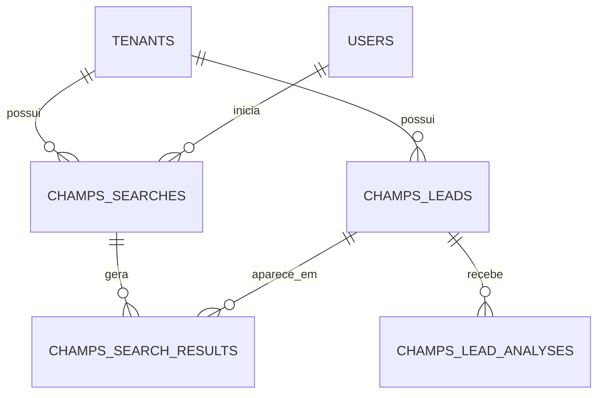

# Modelo de dados do Champs

## Observação

Os nomes definitivos das tabelas serão ajustados após analisarmos as
entidades existentes no CRM.

## Prospecções

Tabela proposta:

```text
champs_searches
```

Campos:

| Campo | Descrição |
|---|---|
| id | Identificador da prospecção |
| tenant_id | Tenant proprietário |
| user_id | Usuário que iniciou |
| name | Nome da prospecção |
| niche | Nicho pesquisado |
| state | Estado pesquisado |
| city | Cidade pesquisada |
| requested_quantity | Quantidade solicitada |
| minimum_score | Score mínimo |
| status | Situação da execução |
| error_message | Mensagem de erro |
| started_at | Início do processamento |
| completed_at | Final do processamento |
| created_at | Data de criação |
| updated_at | Data de atualização |

Status previstos:

```text
PENDING
PROCESSING
COMPLETED
FAILED
```

## Leads

Tabela proposta:

```text
champs_leads
```

Campos:

| Campo | Descrição |
|---|---|
| id | Identificador do lead |
| tenant_id | Tenant proprietário |
| instagram_username | Nome de usuário do Instagram |
| display_name | Nome apresentado no perfil |
| biography | Biografia do perfil |
| profile_url | Link para o perfil |
| category | Categoria comercial |
| city | Cidade |
| state | Estado |
| followers_count | Número de seguidores |
| website | Site |
| phone | Telefone ou WhatsApp |
| email | E-mail |
| source | Origem do dado |
| raw_data | Dados originais em JSON |
| created_at | Data de criação |
| updated_at | Data de atualização |

## Resultados das prospecções

Tabela proposta:

```text
champs_search_results
```

Campos:

| Campo | Descrição |
|---|---|
| id | Identificador |
| tenant_id | Tenant proprietário |
| search_id | Prospecção relacionada |
| lead_id | Lead relacionado |
| created_at | Data do vínculo |

Essa tabela permite que um mesmo lead apareça em mais de uma prospecção
sem precisar ser duplicado.

## Análises

Tabela proposta:

```text
champs_lead_analyses
```

Campos:

| Campo | Descrição |
|---|---|
| id | Identificador da análise |
| tenant_id | Tenant proprietário |
| lead_id | Lead analisado |
| total_score | Score total |
| location_score | Pontos de localização |
| structure_score | Pontos de estrutura |
| commercial_score | Pontos comerciais |
| activity_score | Pontos de atividade |
| contact_score | Pontos de contato |
| classification | Classificação final |
| reasons | Motivos em JSON |
| analyzed_at | Data da análise |
| created_at | Data de criação |
| updated_at | Data de atualização |

## Regras de duplicidade

Dentro do mesmo tenant, um perfil não deverá ser duplicado.

Chave única sugerida:

```text
tenant_id + instagram_username
```

O mesmo perfil poderá existir em tenants diferentes.

## Relacionamentos



## Índices previstos

- índice por `tenant_id`;
- índice único por `tenant_id` e `instagram_username`;
- índice por `search_id`;
- índice por `lead_id`;
- índice por `tenant_id` e `total_score`;
- índice por `tenant_id` e `created_at`.