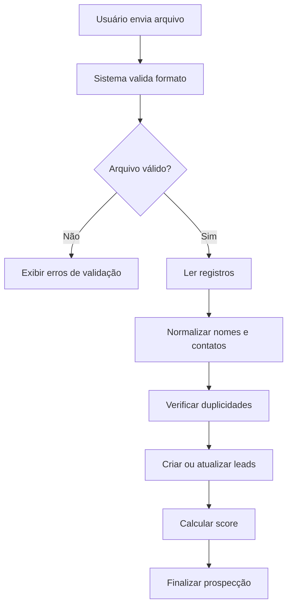

# Integração e origem dos leads

## Objetivo

Definir como os perfis comerciais chegarão ao Champs.

## Situação atual

A fonte automática definitiva dos perfis ainda precisa ser validada.

O MVP não deverá depender exclusivamente de uma integração externa
complexa para funcionar.

## Estratégia incremental

### Fase 1 — Importação

O sistema receberá dados por:

- CSV;
- planilha XLSX, caso seja viável no prazo;
- cadastro manual para testes.

Campos mínimos:

```text
instagram_username
display_name
city
state
followers_count
website
phone
email
```

## Fluxo de importação



## Normalização

O sistema deverá:

- remover `@` do nome de usuário quando necessário;
- converter o Instagram para minúsculas;
- remover espaços desnecessários;
- padronizar estado como `SP` ou `RJ`;
- normalizar telefone;
- validar e-mail;
- garantir que URLs estejam em formato válido.

## Tratamento de duplicidade

Quando um perfil já existir no tenant:

- atualizar campos vazios quando houver novos dados;
- preservar dados válidos;
- criar apenas o vínculo com a nova prospecção;
- não duplicar o lead.

## Fase 2 — Integração automática

Após o MVP, o sistema poderá receber leads de:

- fornecedor de dados;
- API autorizada;
- serviço de enriquecimento;
- rotina externa de coleta;
- ferramenta de automação compatível.

## Restrições

A integração deverá respeitar:

- limites de requisição;
- termos da plataforma utilizada;
- privacidade dos dados;
- tratamento de falhas;
- indisponibilidade de serviços externos.

## Estados da integração

```text
PENDING
PROCESSING
COMPLETED
PARTIALLY_COMPLETED
FAILED
```

## Registro de erros

Cada falha deverá guardar:

- prospecção relacionada;
- data e horário;
- etapa em que ocorreu;
- mensagem técnica;
- mensagem amigável ao usuário;
- quantidade processada;
- quantidade rejeitada.